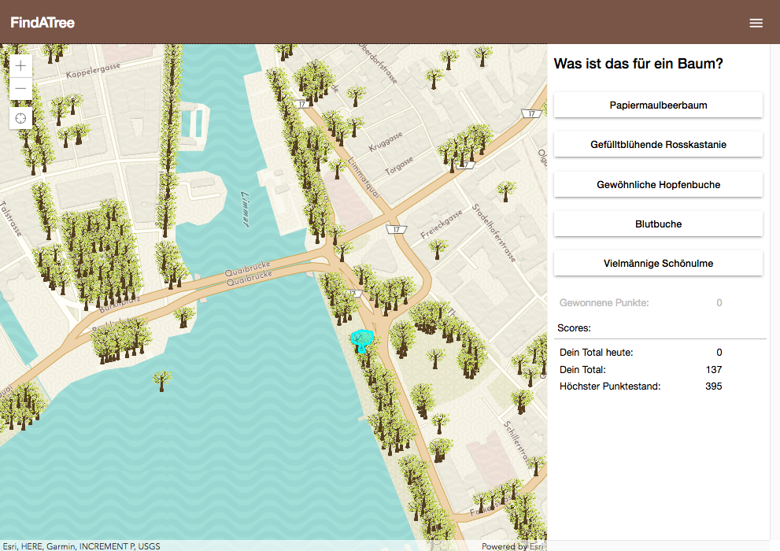

# find:evergreen_tree:tree - Projekt2 - Cas Fee - HSR

## Prototyp einer mobilen Geo-Spiel-App
[](https://captaininler.github.io/findAtree/)

[Live app](https://captaininler.github.io/findAtree/)

Eine App für die Einwohner der Stadt Zürich, um mehr über die Bäume im Stadtgbiet zu erfahren.
Um seine Kenntnisse über Bäume zu erweitern, ist in unserer App ein Spiel enthalten: Rate die Baumart korrekt und gewinne so Punkte.
Sind die Angaben zu den Bäumen falsch oder fehlt ein Baum? Die Daten können auch bearbeitet und neue Bäume hinzugefügt werden.

---
### Hauptfeatures

  - Real-time Visualisierung der Bäume in der Stadt Zürich
  - Editieren von Bäumen || neue Bäume erfassen || Bäume löschen
  - Spiel:
      - Benutzer können die Baumart raten
      - Benutzer erhalten Punkte, wenn sie die Baumart korrekt raten
      - Bei jedem falschen Versuch gibt einen Punkt Abzug
      - Mit Vorteil spielt man das Spiel auf dem Smartphone, während man durch Zürich spaziert

  - Die Abfrage von Baumdaten ist ohne Login möglich. Um die Daten zu ergänzen, zu bearbeiten oder das Spiel zu Spielen, ist es nötig, sich einzuloggen.

---

### Frameworks/Tools/Daten
- Visualisierung mit [ArcGIS API for JavaScript](https://developers.arcgis.com/javascript/)
- Speichern der Bäumen auf [ArcGIS Online](https://doc.arcgis.com/en/arcgis-online/reference/what-is-agol.htm) und Zugriff via [ArcGIS Rest API](https://developers.arcgis.com/rest/services-reference/working-with-services-you-ve-published.htm)
- Authentifizierung und Speichern der Punkte der Spieler auf [Firebase](https://firebase.google.com/)
- [Angular 5](https://angular.io/) für UI, Routing, Animationen
- [Angular Material](https://material.angular.io/) für Styling
- Deployment mit Github Pages: https://captaininler.github.io/findAtree
- Daten von [Baumkataster der Stadt Zürich](https://data.stadt-zuerich.ch/dataset/baumkataster)

---

### Installation

```
git clone https://github.com/CaptainInler/findAtree.git
cd findATree

# Activate node version to use
nvm use 8

# Install node modules
npm install

# Start app on a local server
npm run start

# Build for production
npm run build

# Run unit tests
ng test

# Run linter
ng lint

```

---

### Usability

*Responsive Design*

Die App läuft auf Mobile und Desktop:


<br />
 
*Usability Test*


[Link zu den Usability Tests](./usabilitytesting/usabilitytest.md)


